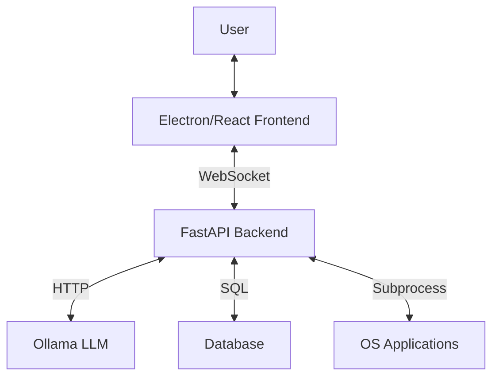

# Eonix Architecture

## Overview
Eonix is designed as a modular, event-driven desktop assistant.

### High-Level Components

## Layers

### 1. Frontend Layer
- **Technology**: Electron, React, Tailwind CSS, Zustand.
- **Responsibility**: Rendering UI, capturing voice/text input, displaying system state.
- **Communication**: Connects to Backend via Socket.IO (`useWebSocket` hook).

### 2. API Layer
- **Technology**: FastAPI.
- **Responsibility**: Exposes REST endpoints and WebSocket events.
- **Security**: API Key authentication (optional), CORS, Rate Limiting.

### 3. Core Logic Layer
- **Orchestrator**: Central brain. Receives commands → Intent Classifier → Task Planner → Execution.
- **Context Manager**: Maintains conversation history.
- **Memory**: Vector database (ChromaDB) for long-term recall.

### 4. AI Layer
- **Ollama Client**: Interface to local LLMs (Llama 3, Mistral).
- **Modules**: Intent Classifier, Entity Extractor, Response Generator.

### 5. Execution Layer
- **File Manager**: Safe file operations.
- **Process Manager**: System process control.
- **App Controller**: Window management and app launching.
- **Automation Engine**: Multi-step workflows.

### 6. Voice Layer
- **STT**: Faster-Whisper (local).
- **TTS**: Piper (local).
- **Wake Word**: Tiny model for "Hey Eonix".
